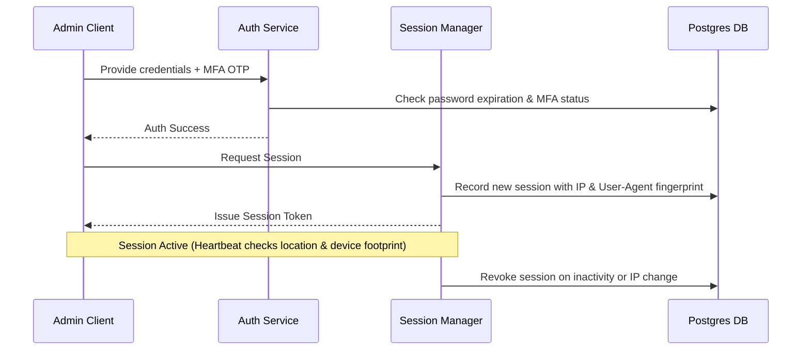

# Aura Estates Enterprise Security Architecture

This document serves as the definitive reference for the security architecture of the Aura Estates platform. It details the defense-in-depth layout implemented across Waves 7A to 7F.

---

## 1. Perimeter Defense & Client Security (Wave 7A, 7D, & 7F)
Aura Estates enforces strict HTTP response controls and boundary sanitization to defend against client-side and web injection exploits.

### Secure HTTP Headers & Clickjacking Mitigation
All platform endpoints served by the application layer include industry-standard security headers configured in [next.config.ts](file:///d:/Project/next.config.ts):
- **`X-Frame-Options: DENY`**: Mitigates clickjacking attacks by preventing pages from being embedded in frames, `<iframe>` elements, or objects.
- **`Content-Security-Policy (CSP)`**: Limits execution origins to authenticated assets (`'self'`) and allowed third parties (e.g. Cloudflare Turnstile). It strictly rejects unvalidated frames.
- **`Strict-Transport-Security (HSTS)`**: Forcefully redirects all HTTP requests to HTTPS, securing sessions against SSL strip attacks.
- **`X-Content-Type-Options: nosniff`**: Rejects execution of MIME types that do not match their designated file type headers.
- **`Referrer-Policy: strict-origin-when-cross-origin`**: Limits leakage of request parameters across origins.
- **`Permissions-Policy`**: Disables access to hardware like cameras, microphones, and geolocation APIs.

### Boundary Sanitization & Injection Defense
- **XSS Mitigation**: Utilizes server-side and DOM-level input validation coupled with DOMPurify sanitization rules to neutralize cross-site scripting (XSS) payloads in lead inquiries and profile edits.
- **Server-Side Template Injection (SSTI)**: A custom regex compiler scans for expression tag injections (`{{ ... }}`) and blocks them before rendering engines parse the variables.
- **ReDoS (Regular Expression Denial of Service)**: The validation helper libraries scan regular expressions against safe-regex parsers to avoid catastrophic backtracking loops.
- **Upload Security**: Enforces file upload type constraints via MIME validation and magic bytes scanning, rejecting spoofed extensions.

---

## 2. Authentication & Session Governance (Wave 7B & 7C)
Platform identities are governed by strict lifecycle patterns.

### Authentication Governance
- **MFA Enforcement**: Enforces Multi-Factor Authentication (OTP verification) for administrative roles (ADMIN and SUPER_ADMIN).
- **Password Policies**: Enforces complex password constraints, password expiration (90 days max age), and tracks password histories to prevent rapid reuse.
- **Immortal Account Protections**: Automatically detects and repels self-suspensions or privilege downgrades of critical administrative accounts.

### Session Intelligence
- **Fingerprinting**: Captures and indexes browser attributes, user-agent details, and IP addresses to create a cryptographic footprint of every active session.
- **Inactivity Timeout**: Automatically revokes sessions after 15 minutes of inactivity.
- **IP & User-Agent Heartbeats**: Validates active session metadata on every API request. A sudden change in IP or User-Agent terminates the session immediately.

---

## 3. Behavioral Analytics & Geosecurity (Wave 7C & 7C.1)
Continuous monitoring is performed to detect compromise and travel anomalies.

### Impossible Travel Verification
Tracks distance and elapsed time between consecutive requests from a single user. If the speed needed to travel between location coordinates exceeds **900 km/h**, the session is flagged, the IP is blacklisted, and a high-severity event is triggered.

### Behavioral Anomaly Engines
Monitors user actions against normal transaction profiles:
- Detects bulk inquiries, rapid search queries, or login bursts.
- Admin-level anomalies (such as access at anomalous hours, unusual exports, or rapid modifications) are escalated to immediate SOC investigation.

---

## 4. Threat Intelligence & Correlation (Wave 7C.2 & 7C.3)
Transforms raw logs into meaningful alerts.

### Threat Feeds
Synchronizes local blacklists with global threat indicators:
- **TOR Exit Nodes**: Real-time integration detects and blocks connections originating from TOR relay nodes.
- **VPN / Proxy Detection**: Restricts operations from residential proxies or datacenter VPN blocks.

### Correlation Engine
Monitors the sequence of security events across the entire cluster.
- **Rule Dependency Parsing**: Chains individual low-severity telemetry (e.g. multiple failed logins -> credential stuffing payload -> successful login from new IP) into critical alerts (e.g., `ACCOUNT_TAKEOVER_ATTEMPT`).

---

## 5. Security Orchestration & Incident Response (SOAR)
Enables automated, rapid response to containment operations.

### Playbooks & Containment Actions
- Deploys playbook templates (e.g., `SESSION_HIJACK_RESPONSE`, `BRUTE_FORCE_CONTAINMENT`).
- **Response Safety Gates**: Enforces dual-authorization on high-privilege containment actions (such as global administrative logout), whereas low-privilege actions (like single session revocation) are executed automatically without delay.

---

## 6. Posture Governance & Compliance (Wave 7F)
Aura Estates consolidates all metrics and compliance standards into a unified Posture Command Center.

- **Unified Posture Score**: Evaluates 8 critical security dimensions (Authentication, Authorization, MFA adoption, Session safety, Threat detection coverage, SOC incident resolution, GDPR/Compliance, Secure headers) to generate a weighted overall score.
- **25 Verified Controls**: Runs automated background verifications across 25 specific security gates spanning the application, data, and infrastructure layers.
- **Baseline Drift Detection**: Compares active configurations against a frozen security baseline, raising alarms on score regressions or control failures.
