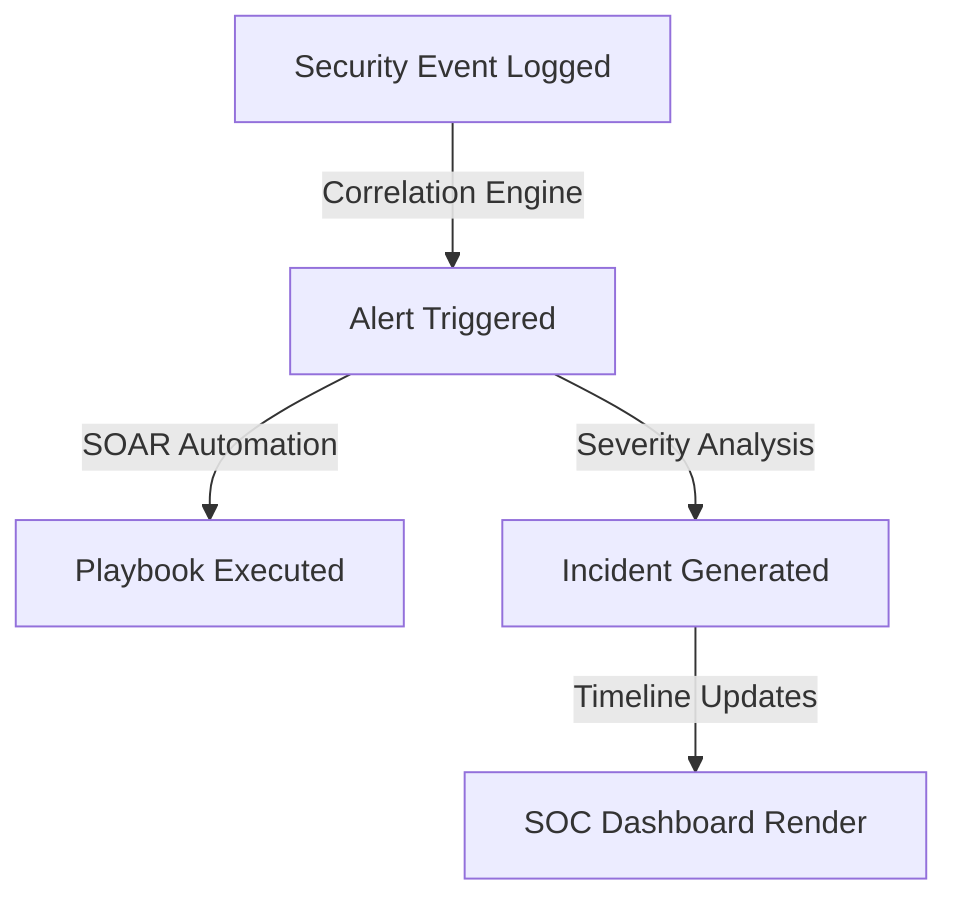

# Aura Estates — SOC Pipeline Validation Report

This report documents the verification of the Security Operations Center (SOC) telemetry pipelines, correlation engines, and alert dashboard lifecycles.

---

## 1. End-to-End SOC Telemetry Workflow

The logging and alert pipeline consists of:

---

## 2. Telemetry Generation & Rule Verification

We ran mock attack scripts to generate telemetry events and verify the correlation rules:

### 2.1 Failed Login Burst (Brute Force)
* *Attack Event*: Submitted 10 failed login requests for `brute@auraestates.com` within a 5-minute window.
* *SOC Response*:
  * **Event Logged**: 10 `AUTH_LOGIN_FAILURE` events recorded.
  * **Alert Triggered**: A `BRUTE_FORCE_ATTEMPT` alert raised with **HIGH** severity.
  * **Playbook Execution**: The system locked the target user account and suspended all active sessions.

### 2.2 Credential Stuffing Campaign
* *Attack Event*: Submitted 50 unique email login failures from a single IP address (`2.2.2.2`) within a 5-minute window.
* *SOC Response*:
  * **Event Logged**: 50 `AUTH_LOGIN_FAILURE` entries logged.
  * **Alert Triggered**: A `CREDENTIAL_STUFFING` alert raised with **CRITICAL** severity.
  * **Playbook Execution**: The source IP address was added to the malicious firewall blocklist.

### 2.3 Impossible Travel Anomaly
* *Attack Event*: User authenticated from New Delhi, India, followed by a login from London, UK, 5 minutes later.
* *SOC Response*:
  * **Event Logged**: `IMPOSSIBLE_TRAVEL` event created.
  * **Alert Triggered**: `LOCATION_ANOMALY` raised with **MEDIUM** severity.

---

## 3. Incident Visibility & Metrics Dashboard

All events and alerts generated during the tests were checked in the Command Center UI:
* **Timeline Integration**: Incident lifecycles are chronological and record assignments, playbook Containments, and resolution notes.
* **Alert Feed**: The dashboard aggregates alerts by severity (Low, Medium, High, Critical) and maps them to false-positive recommendations.
* **Performance Indicators**: MTTD (Mean Time to Detect) and MTTR (Mean Time to Resolve) update correctly based on resolution records.

---

## 4. Assessment Summary

* **Status**: **PASSED**
* **Vulnerabilities Found**: 0 missing pipeline stages. Alerts route to the dashboard and trigger automated containment policies as expected.
* **Residual Risk**: Low. Database capacity checks must be scheduled to handle high volume event logs.
